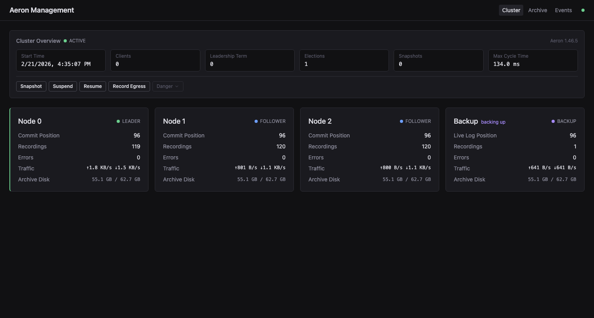
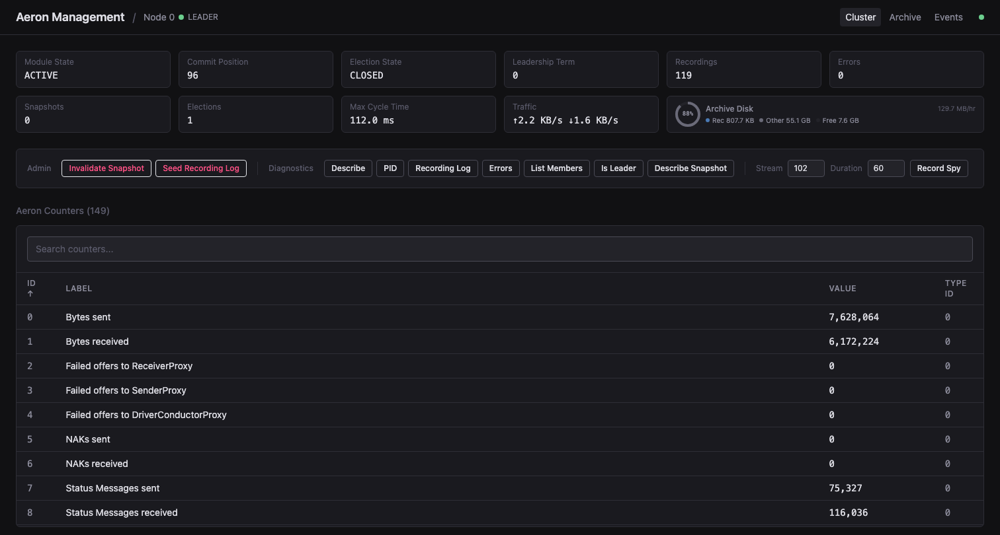
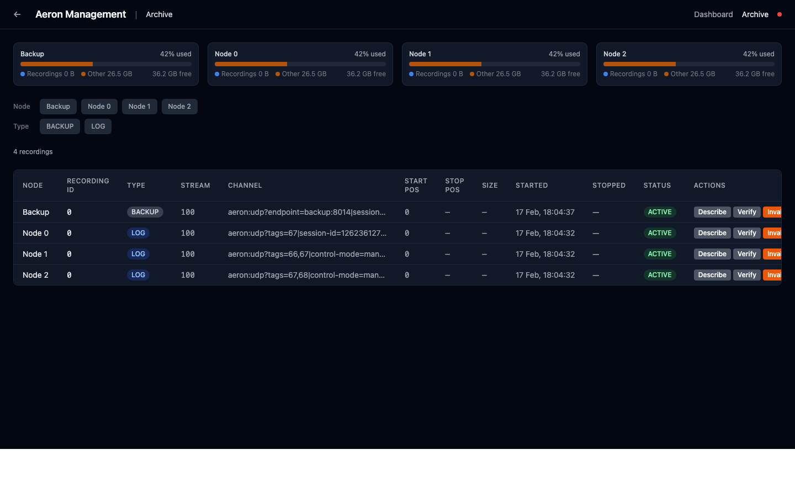
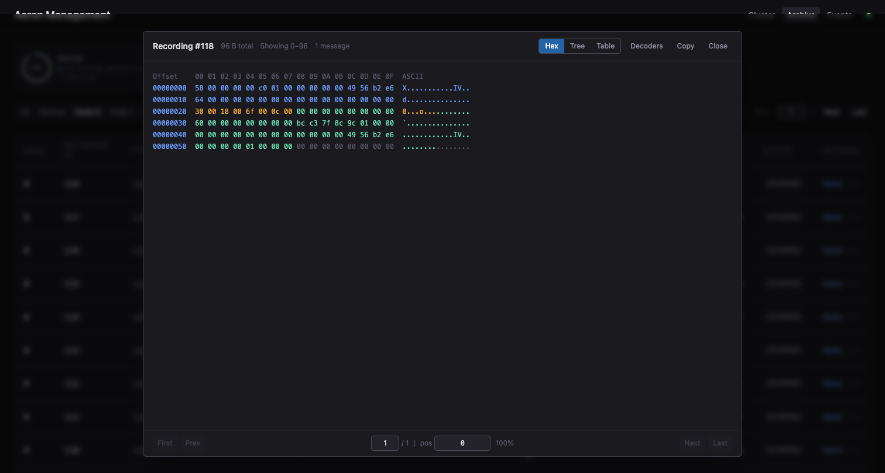
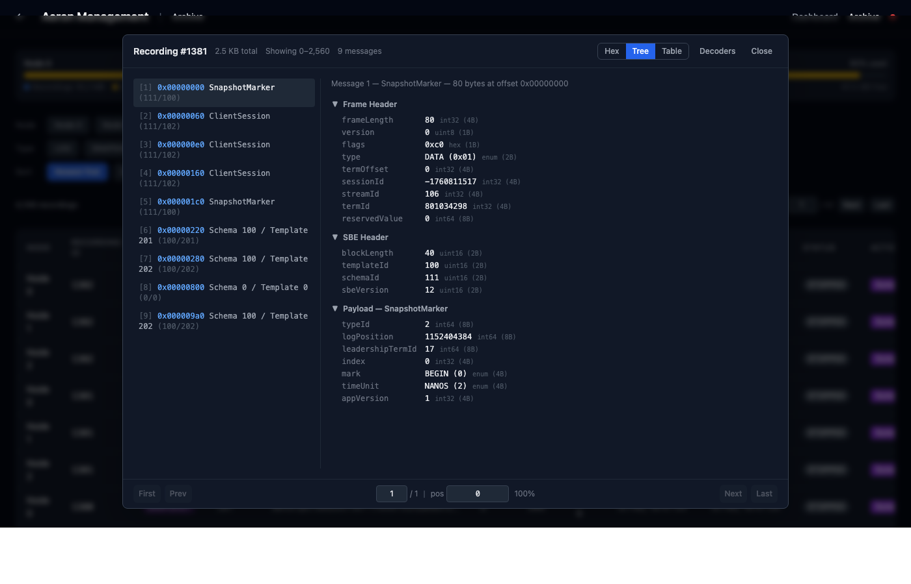

# Aeron Management Center

Web-based monitoring and administration dashboard for [Aeron Cluster](https://aeron.io/).

<p>
  <a href="screenshots/dashboard.png"></a>
  <a href="screenshots/node-detail.png"></a>
  <a href="screenshots/archive.png"></a>
  <a href="screenshots/recording-viewer.png"></a>
  <a href="screenshots/recording-viewer-tree.png"></a>
</p>

## What It Does

- **Live cluster overview** — node roles, commit positions, elections, traffic rates, all updating in real time
- **Cluster state awareness** — see at a glance if the cluster is active, suspended, snapshotting, or shutting down
- **One-click admin** — Snapshot, Suspend, Resume, Shutdown directly from the dashboard, automatically routed to the leader
- **Archive browser** — paginated recordings table with type filtering, per-recording actions (verify, invalidate), and bulk operations (compact, delete orphaned segments)
- **Recording viewer** — inspect recording bytes with annotated hex, decoded tree, and message table views; built-in decoders for Aeron cluster SBE messages (SnapshotMarker, ClientSession, etc.) plus custom decoder support via JSON import
- **Disk forecasting** — growth rate tracking with time-to-full predictions per node
- **Backup node monitoring** — dedicated view for ClusterBackup agents
- **Native image agents** — optional GraalVM native compilation for ~20MB sidecar footprint

## Architecture

```
  React UI  <--- WebSocket/REST --->  Spring Boot Server  <--- gRPC --->  Agent sidecars
                                                                              |
                                                                         Aeron Nodes
```

Each agent is a lightweight sidecar sharing IPC with its Aeron node. It reads CnC counters and the archive catalog directly, streams metrics to the server over gRPC, and executes ClusterTool/ArchiveTool commands on demand.

## Quick Start

```bash
docker compose -f examples/docker/docker-compose.full-system.yml up --build
```

Open **http://localhost:8080**. See [examples/docker](examples/docker) for more setups including native agents and larger clusters.

## Tech Stack

| | |
|-|-|
| **Agent** | Java 17, Aeron 1.50.1, gRPC, Protobuf (optional: GraalVM native image) |
| **Server** | Spring Boot 3, gRPC, STOMP WebSocket |
| **UI** | React 18, TypeScript, Tailwind CSS, Zustand, Recharts |
| **CI/CD** | GitHub Actions, Docker Buildx, ghcr.io |

## Documentation

| | |
|-|-|
| [Agent configuration](agent) | Environment variables, health endpoint |
| [Server configuration](server) | HTTP and gRPC ports, metrics history |
| [Docker Compose examples](examples/docker) | Full system, native agents, big cluster |
| [Kubernetes example](examples/k8s) | Deploying on kind |

## License

[AGPL-3.0](LICENSE)
